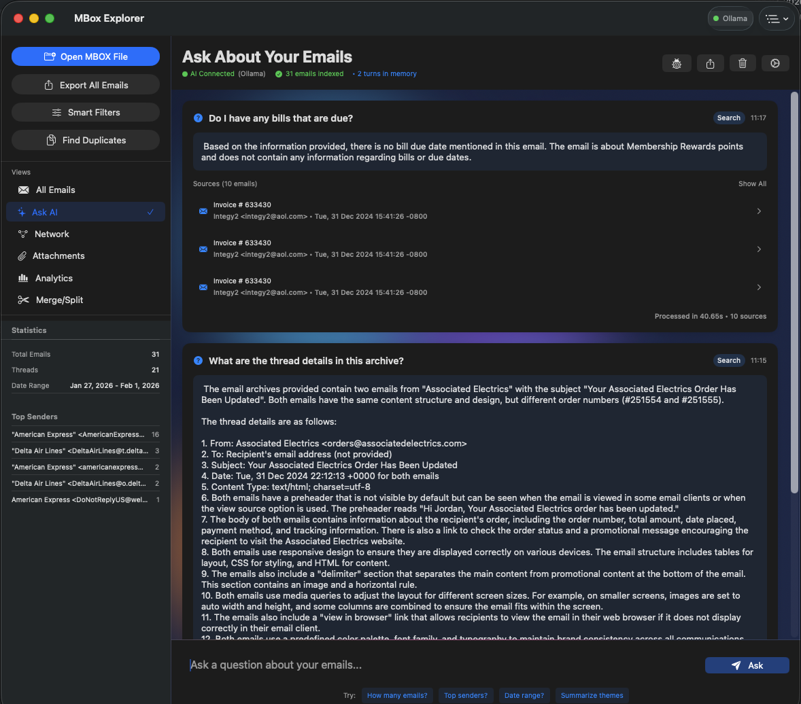

# MBox Explorer

**AI-Powered Email Archive Analysis with Native RAG Pipeline**



## Download

Download the latest release: [MBox Explorer v2.2.1](https://github.com/kochj23/MBox-Explorer/releases/latest)

Or build from source (see below).

---


---

## ✨ Latest Update: v2.4 - February 4, 2026

### 📱 macOS Widget (v2.4)

New **WidgetKit widget** for macOS Notification Center:

- **Three Widget Sizes**: Small, Medium, and Large
- **Email Statistics**: Total emails, threads, date range at a glance
- **Top Senders**: See who emails you most frequently
- **Recent Searches**: Quick access to your recent queries
- **Quick Search Action**: Jump directly to search in the app
- **Auto-Sync**: Widget updates automatically when you load new mbox files
- **App Group Sharing**: Secure data sharing via `group.com.jkoch.mboxexplorer`

**Widget Features by Size:**

| Size | Features |
|------|----------|
| Small | Email count, loaded file name |
| Medium | Stats + Top 3 senders |
| Large | Stats + Top senders + Recent searches + Quick search button |

---

### 🔧 RAG Pipeline Reliability Improvements (v2.3)

- **Memory-safe SQLite bindings** - Fixed SQLITE_TRANSIENT for all string bindings preventing crashes
- **FTS5 auto-sync triggers** - Full-text search index automatically syncs with vector database
- **Smart three-tier search** - Semantic → FTS keywords → Sample fallback ensures results always found
- **Keyword extraction** - Stop-word filtering for natural language queries to FTS5
- **Extended timeouts** - 3 minute request / 10 minute resource timeout for large RAG queries
- **Robust JOIN queries** - FTS5 external content tables properly joined for complete data retrieval

### 🎉 12 New Features in v2.2:

#### 📊 Productivity & Analysis
- **Search History** - Recent and saved searches with persistence
- **Email Statistics Dashboard** - Comprehensive analytics with Charts
- **Sentiment Dashboard** - Analyze email tone using NaturalLanguage
- **Email Diff View** - Compare emails side-by-side with highlighting

#### 🔍 System Integration
- **Spotlight Integration** - Find emails via macOS system search
- **Quick Look Preview** - Space bar preview (native macOS)
- **Notification Center** - Reminders and follow-ups

#### 🤖 AI Features
- **Smart Reply Suggestions** - AI-powered replies with tone options
- **Meeting/Event Extractor** - Extract calendar events with EventKit

#### 📤 Batch & Export
- **Batch Operations Toolbar** - Multi-select tag, star, export, print
- **Contact Exporter** - Export to vCard, CSV, or Address Book

---

### 🎉 Previous v2.x Features:

#### 🤖 Native RAG Pipeline
- **Retrieval-Augmented Generation** built entirely in Swift
- **Vector database** with SQLite + FTS5 full-text search
- **Semantic search** via Ollama embeddings
- **Smart question routing** for optimal context selection
- **Conversation memory** for follow-up questions
- **Custom system prompts** for personalized AI behavior

#### 💬 Ask AI Interface (NEW)
- Natural language queries about your email archive
- Real-time AI responses with source citations
- Debug panel to inspect AI prompts
- Export conversations to Markdown/JSON
- Temperature controls to reduce hallucinations

#### ☁️ Cloud AI Integration (5 Providers)
- **OpenAI API** - GPT-4o for advanced capabilities
- **Google Cloud AI** - Vertex AI, Vision, Speech
- **Microsoft Azure** - Cognitive Services
- **AWS AI Services** - Bedrock, Rekognition, Polly
- **IBM Watson** - NLU, Speech, Discovery

#### 🛡️ Ethical AI Safeguards
- Comprehensive content monitoring
- Prohibited use detection (100+ patterns)
- Automatic blocking of illegal/harmful content
- Crisis resource referrals
- Legal compliance (CSAM reporting, etc.)

---

## 🧠 RAG Pipeline Architecture

MBox Explorer includes a **native RAG (Retrieval-Augmented Generation) pipeline** - no external frameworks required.

### Pipeline Components

```
┌─────────────────────────────────────────────────────────────────┐
│                        RAG PIPELINE                              │
├─────────────────────────────────────────────────────────────────┤
│                                                                  │
│  ┌──────────┐    ┌──────────┐    ┌──────────┐    ┌──────────┐  │
│  │  Query   │───▶│ Question │───▶│ Retrieve │───▶│ Augment  │  │
│  │  Input   │    │  Router  │    │ Context  │    │  Prompt  │  │
│  └──────────┘    └──────────┘    └──────────┘    └──────────┘  │
│                                         │              │        │
│                                         ▼              ▼        │
│                                  ┌──────────┐    ┌──────────┐  │
│                                  │  Vector  │    │   LLM    │  │
│                                  │    DB    │    │ Generate │  │
│                                  └──────────┘    └──────────┘  │
│                                                        │        │
│                                                        ▼        │
│                                                 ┌──────────┐   │
│                                                 │ Response │   │
│                                                 │ + Sources│   │
│                                                 └──────────┘   │
└─────────────────────────────────────────────────────────────────┘
```

### 1. Document Store (`VectorDatabase.swift`)

| Feature | Implementation |
|---------|----------------|
| Storage | SQLite database (`~/Library/Application Support/MBoxExplorer/vectors.db`) |
| Full-text search | FTS5 with ranking |
| Vector storage | Float arrays as BLOBs |
| Indexing | Batch processing with progress |

### 2. Embedding Generation

MBox Explorer supports **4 embedding providers** - choose based on your needs:

#### Embedding Provider Comparison

| Provider | Cost | Privacy | Speed | Quality | Setup |
|----------|------|---------|-------|---------|-------|
| **Ollama** | Free | 100% Local | Fast | Good | `brew install ollama && ollama pull nomic-embed-text` |
| **MLX** | Free | 100% Local | Very Fast | Good | Built-in (Apple Silicon only) |
| **OpenAI** | $0.02/1M tokens | Cloud | Fast | Excellent | API key required |
| **Sentence Transformers** | Free | 100% Local | Medium | Excellent | `pip install sentence-transformers` |

#### Detailed Provider Analysis

**1. Ollama Embeddings** (Recommended for most users)
| Aspect | Details |
|--------|---------|
| Pros | Free, private, runs locally, easy setup, multiple models |
| Cons | Requires Ollama daemon running |
| Models | `nomic-embed-text` (768d), `all-minilm` (384d), `mxbai-embed-large` (1024d) |
| Best for | Users who want local, private semantic search |

**2. MLX Embeddings** (Best for Apple Silicon users)
| Aspect | Details |
|--------|---------|
| Pros | Native Apple Silicon, fastest inference, no external dependencies |
| Cons | macOS only, Apple Silicon required, model download on first use |
| Models | `all-MiniLM-L6-v2` (384d), `nomic-embed-text-v1.5` (768d), `bge-small-en-v1.5` (384d) |
| Best for | M1/M2/M3 Mac users wanting maximum performance |

**3. OpenAI Embeddings** (Best quality)
| Aspect | Details |
|--------|---------|
| Pros | Highest quality, well-documented, reliable |
| Cons | Costs money, data sent to cloud, requires API key |
| Models | `text-embedding-3-small` (1536d, $0.02/1M), `text-embedding-3-large` (3072d, $0.13/1M) |
| Best for | Users who prioritize quality and don't mind cloud processing |

**4. Sentence Transformers** (Best flexibility)
| Aspect | Details |
|--------|---------|
| Pros | Excellent quality, huge model selection, local processing |
| Cons | Requires Python, slower startup, larger disk footprint |
| Models | Any HuggingFace sentence-transformers model |
| Best for | ML enthusiasts who want model flexibility |

#### Configuration

- **Storage**: Embeddings stored in SQLite as binary data
- **Chunking strategy**: Subject + first 500 characters of body
- **Dimension tracking**: Automatically tracked per provider
- **Provider switching**: Change in Settings → AI → Embedding Provider

### 3. Retrieval Methods

```swift
// Three search modes with automatic fallback:

1. Semantic Search (if Ollama available)
   → Generate query embedding
   → Cosine similarity against stored embeddings
   → Return top 20 results

2. Keyword Search (FTS5 fallback)
   → FTS5 MATCH query
   → Ranked by relevance
   → Snippet extraction

3. Direct Search (no indexing required)
   → In-memory text matching
   → Score by term frequency
   → Bonus for subject/sender matches
```

### 4. Smart Question Routing

The pipeline automatically detects question types and optimizes context:

| Question Type | Example | Context Used |
|---------------|---------|--------------|
| `STATISTICS` | "How many emails?" | Metadata only |
| `TOP_LIST` | "Who sent the most?" | Metadata + samples |
| `DATE_RANGE` | "What's the date range?" | Metadata only |
| `CONTENT_SEARCH` | "Find emails about project X" | Full RAG search |
| `SUMMARY` | "Summarize main themes" | Extended context (15 emails) |
| `FOLLOW_UP` | "Tell me more" | Previous conversation + search |

### 5. Context Augmentation

The prompt sent to the LLM includes:

```
MAILBOX STATISTICS:
- Total emails: [count]
- Date range: [start] - [end]
- Total threads: [count]
- Unique senders: [count]
- Top senders: [list with counts]

PREVIOUS CONVERSATION: (if memory enabled)
[Recent Q&A turns for context]

RETRIEVED EMAILS:
From: [sender]
Subject: [subject]
Date: [date]
Content: [snippet]
---
[...more relevant emails...]

USER QUESTION: [query]
```

### 6. Generation Settings

| Setting | Default | Purpose |
|---------|---------|---------|
| Q&A Temperature | 0.2 | Low for factual accuracy |
| Summary Temperature | 0.3 | Slightly higher for synthesis |
| Creative Temperature | 0.7 | Higher for varied output |
| Max Conversation History | 10 turns | Follow-up context |

---

## 🎯 Features

Perfect for **enterprise email migration**, compliance review, legal discovery, and archiving old mailboxes.

### Ask AI Interface

- **Natural language queries** - Ask questions about your emails in plain English
- **Source citations** - See which emails were used to generate answers
- **Debug panel** - Inspect the full prompt sent to the AI
- **Conversation memory** - Follow-up questions maintain context
- **Export conversations** - Save Q&A sessions as Markdown or JSON
- **Custom system prompts** - Modify AI behavior in settings

### Email Analysis

- **Smart filters** - Filter by sender, date, size, attachments
- **Thread detection** - Group related emails
- **Duplicate finder** - Identify duplicate messages
- **Statistics dashboard** - Email counts, top senders, date ranges
- **Network visualization** - See communication patterns
- **Attachment browser** - Browse and export attachments

### AI Backend Support

#### LLM Providers (Text Generation)

| Backend | Type | Cost | Features |
|---------|------|------|----------|
| Ollama | Local | Free | LLM + Embeddings |
| MLX | Local | Free | Apple Silicon optimized LLM |
| **TinyChat** | Local | Free | Fast chatbot with OpenAI-compatible API |
| **TinyLLM** | Local | Free | Lightweight LLM server |
| OpenWebUI | Self-hosted | Free | Web interface |
| OpenAI | Cloud | Paid | GPT-4o |
| Google Cloud | Cloud | Paid | Vertex AI |
| Azure | Cloud | Paid | Cognitive Services |
| AWS | Cloud | Paid | Bedrock |
| IBM Watson | Cloud | Paid | NLU |

---

### TinyChat & TinyLLM by Jason Cox

MBox Explorer proudly supports [**TinyChat**](https://github.com/jasonacox/tinychat) and [**TinyLLM**](https://github.com/jasonacox/TinyLLM) - two excellent open-source projects by [Jason Cox](https://github.com/jasonacox).

#### Why TinyChat?

**TinyChat** is a lightweight, fast chatbot interface with an OpenAI-compatible API. It's perfect for:
- **Quick local inference** without heavy dependencies
- **Privacy-first AI** - all processing stays on your machine
- **Easy setup** - minimal configuration needed
- **OpenAI API compatibility** - works seamlessly with existing tools

#### Why TinyLLM?

**TinyLLM** is a minimalist LLM server that provides:
- **Lightweight deployment** - runs on modest hardware
- **OpenAI-compatible endpoints** - drop-in replacement
- **Local-first architecture** - your data never leaves your device
- **Active development** - regularly updated with new features

#### Installation

```bash
# TinyChat - Fast chatbot interface
git clone https://github.com/jasonacox/tinychat.git
cd tinychat
pip install -r requirements.txt
python server.py  # Starts on localhost:8000

# TinyLLM - Lightweight LLM server
git clone https://github.com/jasonacox/TinyLLM.git
cd TinyLLM
pip install -r requirements.txt
python server.py  # Starts on localhost:8000
```

#### Configuration in MBox Explorer

1. Start TinyChat or TinyLLM server
2. Open MBox Explorer → Settings (⌘⌥A)
3. Select "TinyChat" or "TinyLLM" as your AI Backend
4. Default endpoint: `http://localhost:8000`
5. Start using AI features!

#### Features Supported

| Feature | TinyChat | TinyLLM |
|---------|----------|---------|
| Text Generation | ✅ | ✅ |
| Embeddings | ✅ | ✅ |
| Streaming Responses | ✅ | ✅ |
| OpenAI API Compatibility | ✅ | ✅ |
| Local Processing | ✅ | ✅ |

**Attribution:** TinyChat and TinyLLM are created by [Jason Cox](https://github.com/jasonacox). We're grateful for his excellent work making local AI accessible to everyone.

#### Embedding Providers (Semantic Search)

| Provider | Type | Cost | Dimensions | Speed |
|----------|------|------|------------|-------|
| Ollama | Local | Free | 384-1024 | Fast |
| MLX | Local | Free | 384-768 | Very Fast |
| OpenAI | Cloud | Paid | 1536-3072 | Fast |
| Sentence Transformers | Local | Free | 384-768+ | Medium |

---

## 📦 Installation

### From DMG
```bash
open MBox-Explorer-latest.dmg
# Drag to Applications
```

### From Source
```bash
cd "/Volumes/Data/xcode/MBox Explorer"
xcodebuild -scheme "MBox Explorer" -configuration Release build
cp -R build/Release/*.app ~/Applications/
```

### Dependencies Installation

#### Prerequisites

```bash
# Install Homebrew (if not already installed)
/bin/bash -c "$(curl -fsSL https://raw.githubusercontent.com/Homebrew/install/HEAD/install.sh)"

# Verify Homebrew installation
brew --version
```

---

#### Option 1: Ollama (Recommended - Local & Free)

Ollama provides both LLM and embedding capabilities locally on your Mac.

```bash
# Install Ollama
brew install ollama

# Start Ollama service (runs in background)
ollama serve

# Or start Ollama as a background service that auto-starts on login
brew services start ollama
```

**Pull Required Models:**
```bash
# LLM Models (for chat/Q&A) - choose one or more:
ollama pull mistral:latest          # 7B params, good balance of speed/quality
ollama pull llama3.2:latest         # Meta's latest, very capable
ollama pull gemma2:2b               # Smaller, faster
ollama pull phi3:latest             # Microsoft's efficient model

# Embedding Models (for semantic search) - choose one:
ollama pull nomic-embed-text        # Recommended - 768 dimensions, good quality
ollama pull all-minilm              # Smaller - 384 dimensions, faster
ollama pull mxbai-embed-large       # Larger - 1024 dimensions, best quality
```

**Verify Ollama is working:**
```bash
# Check Ollama is running
curl http://localhost:11434/api/tags

# Test embedding generation
curl http://localhost:11434/api/embeddings -d '{"model": "nomic-embed-text", "prompt": "Hello"}'
```

---

#### Option 2: MLX (Apple Silicon - Fastest)

MLX runs natively on Apple Silicon (M1/M2/M3/M4) with no external dependencies.

```bash
# No installation required!
# MLX is built into MBox Explorer

# Just select "MLX" in:
# Settings → AI → Embedding Provider

# Models download automatically on first use (~100-500MB per model)
# Stored in: ~/Library/Application Support/MBoxExplorer/MLXModels/
```

**Available MLX Embedding Models:**
- `all-MiniLM-L6-v2` (384 dimensions) - Default, fast
- `nomic-embed-text-v1.5` (768 dimensions) - Better quality
- `bge-small-en-v1.5` (384 dimensions) - Alternative
- `bge-base-en-v1.5` (768 dimensions) - Best quality

---

#### Option 3: OpenAI (Cloud - Best Quality)

OpenAI provides the highest quality embeddings but requires an API key and costs money.

```bash
# 1. Get an API key:
#    - Go to https://platform.openai.com/
#    - Sign in or create account
#    - Navigate to API Keys section
#    - Create new secret key
#    - Copy the key (starts with sk-)

# 2. Enter key in MBox Explorer:
#    Settings → AI → Cloud API Keys → OpenAI

# 3. Select OpenAI in:
#    Settings → AI → Embedding Provider
```

**Pricing (as of 2024):**
| Model | Dimensions | Cost per 1M tokens |
|-------|------------|-------------------|
| text-embedding-3-small | 1536 | $0.02 |
| text-embedding-3-large | 3072 | $0.13 |
| text-embedding-ada-002 | 1536 | $0.10 (legacy) |

**Estimate:** ~250,000 emails = ~$0.50-$5.00 depending on email length and model.

---

#### Option 4: Sentence Transformers (Python - Most Flexible)

Sentence Transformers offers the widest model selection via Python.

**Step 1: Install Python (if not already installed)**
```bash
# Check if Python 3 is installed
python3 --version

# If not installed, install via Homebrew:
brew install python@3.11

# Or install via official installer:
# https://www.python.org/downloads/
```

**Step 2: Install sentence-transformers**
```bash
# Using pip (recommended)
pip3 install sentence-transformers

# Or using pip with user flag (if permission issues)
pip3 install --user sentence-transformers

# Or using virtual environment (cleanest)
python3 -m venv ~/mbox-env
source ~/mbox-env/bin/activate
pip install sentence-transformers
```

**Step 3: Verify Installation**
```bash
# Test that sentence-transformers works
python3 -c "from sentence_transformers import SentenceTransformer; print('OK')"
```

**Step 4: Configure in MBox Explorer**
```bash
# 1. Set Python path in Settings if using non-standard location:
#    Settings → AI → Sentence Transformers → Python Path
#    Default: /usr/bin/python3
#    Homebrew: /opt/homebrew/bin/python3
#    Virtual env: ~/mbox-env/bin/python

# 2. Select Sentence Transformers in:
#    Settings → AI → Embedding Provider
```

**Available Models (auto-downloaded on first use):**
| Model | Dimensions | Size | Quality |
|-------|------------|------|---------|
| all-MiniLM-L6-v2 | 384 | 80MB | Good |
| all-mpnet-base-v2 | 768 | 420MB | Better |
| paraphrase-MiniLM-L6-v2 | 384 | 80MB | Good for paraphrase |
| multi-qa-MiniLM-L6-cos-v1 | 384 | 80MB | Optimized for Q&A |

---

#### Troubleshooting Dependencies

**Ollama not connecting:**
```bash
# Check if Ollama is running
ps aux | grep ollama

# Restart Ollama
brew services restart ollama
# Or manually:
killall ollama && ollama serve
```

**Python/pip not found:**
```bash
# Add Homebrew Python to PATH
echo 'export PATH="/opt/homebrew/bin:$PATH"' >> ~/.zshrc
source ~/.zshrc
```

**sentence-transformers import error:**
```bash
# Install with all dependencies
pip3 install sentence-transformers torch transformers
```

**MLX models not downloading:**
```bash
# Check internet connection
# Models are downloaded from huggingface.co
# Check disk space in ~/Library/Application Support/MBoxExplorer/
```

---

## 🎓 Usage

### Basic Workflow

1. **Launch** MBox Explorer
2. **Open** an MBOX file (File → Open or ⌘O)
3. **Browse** emails in the list view
4. **Ask AI** - Click "Ask AI" in sidebar for natural language queries

### Ask AI Tips

- **Statistics questions**: "How many emails?", "Who are the top senders?"
- **Content search**: "Find emails about [topic]"
- **Summaries**: "Summarize the main themes"
- **Follow-ups**: "Tell me more about that" (uses conversation memory)

### Indexing (Optional but Recommended)

Click "Index Emails" for:
- Faster searches on large archives
- Semantic search (finds conceptually related emails)
- Better relevance ranking

Without indexing, basic text search still works.

---

## 🔧 Configuration

### RAG Pipeline Settings

Access via gear icon (⚙️) in Ask AI view:

- **Conversation Memory**: Enable/disable, set history length
- **Custom System Prompt**: Modify AI instructions
- **Debug Mode**: See full prompts sent to AI

### Temperature Settings

Access via AI Settings:

- **Q&A Temperature** (0.0-1.0): Lower = more factual
- **Summary Temperature**: For email summaries
- **Creative Temperature**: For open-ended tasks

---

## 🔒 Security & Ethics

### Ethical AI Guardian

All AI operations are monitored for:
- ✅ Legal compliance
- ✅ Ethical use
- ✅ Safety
- ✅ Privacy protection

### Data Privacy

- **Local processing**: Ollama/MLX run entirely on your Mac
- **No cloud required**: Cloud AI is optional
- **Your data stays yours**: Emails never leave your device unless you choose cloud AI

---

## 🛠️ Development

**Author:** Jordan Koch ([@kochj23](https://github.com/kochj23))

**Built with:**
- SwiftUI
- SQLite (FTS5 + Vector storage)
- Ollama API
- Native macOS APIs

**Architecture:**
- MVVM pattern
- Native RAG pipeline
- Multi-backend AI support
- Ethical safeguards

---

## 📊 Version History

### v2.4 - Widget Edition (February 4, 2026)
- **macOS WidgetKit Widget** - View email stats from Notification Center
  - Small widget: Email count and loaded file
  - Medium widget: Stats + Top 3 senders
  - Large widget: Stats + Senders + Recent queries + Quick search
- **App Group Data Sharing** - Secure data sync between app and widget
- **Auto-Sync on Load** - Widget updates when mbox files are loaded
- **SharedDataManager** - Unified data management for widget integration

### v2.3 - RAG Reliability Edition (January 30, 2026)
- **Critical bug fixes** for RAG pipeline reliability:
  - Fixed memory corruption crash (EXC_BAD_ACCESS) with SQLITE_TRANSIENT bindings
  - Fixed FTS5 index not syncing with email_vectors table (added triggers)
  - Fixed FTS5 queries returning NULL data (added proper JOINs)
  - Fixed RAG returning "0 sources" for natural language queries
- **Smart three-tier search fallback**:
  - 1st: Semantic search via embeddings
  - 2nd: FTS5 keyword search with stop-word extraction
  - 3rd: Sample of recent emails when search terms don't match
- **Extended timeouts**: 3 minute request / 10 minute resource for large contexts
- **Improved keyword extraction**: Filters common stop words for better FTS5 matches

### v2.2 - Advanced Features Edition (January 30, 2026)
- **12 New Features** for enhanced productivity:
  - **Search History** - Recent and saved searches with persistence
  - **Email Statistics Dashboard** - Comprehensive analytics with Charts visualizations
  - **Spotlight Integration** - Find emails via macOS system search
  - **Quick Look Preview** - Space bar preview for emails (native macOS Quick Look)
  - **Batch Operations Toolbar** - Multi-select tag, star, export, print operations
  - **Sentiment Dashboard** - Email sentiment analysis using NaturalLanguage framework
  - **Smart Reply Suggestions** - AI-powered reply generation with tone options
  - **Meeting/Event Extractor** - Extract calendar events from emails with EventKit integration
  - **Notification Center Integration** - Reminders and follow-up notifications
  - **Email Diff View** - Compare emails side-by-side with diff highlighting
  - **Contact Exporter** - Export contacts to vCard, CSV, or Address Book

### v2.1 - Multi-Provider Embeddings (January 30, 2026)
- **4 Embedding Providers**: Ollama, MLX, OpenAI, Sentence Transformers
- Provider comparison table with pros/cons
- Automatic provider detection and fallback
- MLX native Apple Silicon embeddings
- OpenAI text-embedding-3-small/large support
- Python bridge for sentence-transformers
- Unified EmbeddingManager for all providers

### v2.0 - RAG Edition (January 30, 2026)
- Native RAG pipeline implementation
- Ask AI interface with conversation memory
- Smart question routing
- Debug panel for prompt inspection
- Export conversations
- Direct search fallback (no indexing required)
- Temperature controls
- Custom system prompts

### v1.5 - Cloud AI Edition (January 26, 2026)
- Added 5 cloud AI providers
- Added ethical safeguards
- AI backend status menu
- Auto-fallback system

### v1.0 - Initial Release
- MBOX file parsing
- Email browsing and search
- Export capabilities
- Basic AI integration

---

## 🆘 Support

### App Support
- GitHub Issues: [Report bugs](https://github.com/kochj23/MBox-Explorer/issues)
- Documentation: See project files

### Crisis Resources
- **988** - Suicide Prevention Lifeline
- **741741** - Crisis Text Line (text HOME)
- **1-800-799-7233** - Domestic Violence Hotline

---

## 📄 License

MIT License - See LICENSE file

**Ethical Usage Required** - See ETHICAL_AI_TERMS_OF_SERVICE.md

---

**MBox Explorer - AI-Powered Email Archive Analysis**

© 2026 Jordan Koch. All rights reserved.
