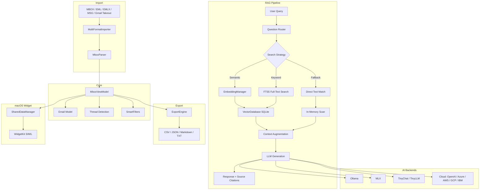

# MBox Explorer


**AI-powered email archive viewer with native RAG pipeline, multi-format import, and semantic search.**

MBox Explorer parses MBOX, EML, EMLX, MSG, and Gmail Takeout archives into a searchable, threaded interface with a built-in retrieval-augmented generation pipeline for natural language queries against your email history. All AI processing runs locally via Ollama or MLX -- no data leaves your machine unless you opt into a cloud provider.

Written by Jordan Koch.

---

## Architecture


```mermaid
graph TD
    subgraph Import
        A[MBOX / EML / EMLX / MSG / Gmail Takeout] --> B[MultiFormatImporter]
        B --> C[MboxParser]
    end

    subgraph Core
        C --> D[MboxViewModel]
        D --> E[Email Model]
        D --> F[Thread Detection]
        D --> G[SmartFilters]
    end

    subgraph RAG["RAG Pipeline"]
        H[User Query] --> I[Question Router]
        I --> J{Search Strategy}
        J -->|Semantic| K[EmbeddingManager]
        J -->|Keyword| L[FTS5 Full-Text Search]
        J -->|Fallback| M[Direct Text Match]
        K --> N[VectorDatabase SQLite]
        L --> N
        M --> O[In-Memory Scan]
        N --> P[Context Augmentation]
        O --> P
        P --> Q[LLM Generation]
        Q --> R[Response + Source Citations]
    end

    subgraph Backends["AI Backends"]
        Q --> S[Ollama]
        Q --> T[MLX]
        Q --> U[TinyChat / TinyLLM]
        Q --> V[Cloud: OpenAI / Azure / AWS / GCP / IBM]
    end

    subgraph Export
        D --> W[ExportEngine]
        W --> X[CSV / JSON / Markdown / TXT]
    end

    subgraph Widget["macOS Widget"]
        D --> Y[SharedDataManager]
        Y --> Z[WidgetKit S/M/L]
    end
```

---

## Features

### Email Parsing and Browsing

| Capability | Details |
|---|---|
| Supported formats | MBOX, EML, EMLX, Outlook MSG, Gmail Takeout ZIP |
| Thread detection | Groups emails by Message-ID / In-Reply-To / References |
| Smart filters | Filter by sender, domain, date range, size, attachments |
| Duplicate finder | Identifies duplicate messages across archives |
| Regex search | Pattern-based search across bodies and headers |
| Attachment browser | Browse, preview, and export attachments |
| PII redaction | Redact personal information before export |
| Mailbox merger | Combine multiple archives into one |
| Tags and collections | Organize emails with custom tags |
| Command palette | Quick access to all actions |

### Ask AI (RAG Pipeline)

| Component | Implementation |
|---|---|
| Vector database | SQLite + FTS5 full-text search + float-array embeddings |
| Search strategy | Three-tier fallback: semantic, FTS5 keyword, direct text match |
| Question routing | Auto-detects query type (statistics, content, summary, follow-up) |
| Conversation memory | Maintains context across follow-ups (configurable history) |
| Source citations | Every response shows which emails were used |
| Temperature controls | Separate for Q&A (0.2), summary (0.3), creative (0.7) |
| Debug panel | Inspect the full prompt sent to the LLM |
| Export conversations | Save Q&A sessions as Markdown or JSON |

### Embedding Providers

| Provider | Type | Setup |
|---|---|---|
| Ollama | Local, free | `brew install ollama && ollama pull nomic-embed-text` |
| MLX | Local, free | Built-in (Apple Silicon only) |
| OpenAI | Cloud, paid | API key in Settings |
| Sentence Transformers | Local, free | `pip install sentence-transformers` |
| TinyChat | Local, free | OpenAI-compatible API on localhost |
| OpenWebUI | Self-hosted | Web UI with embeddings |

### AI Analysis

- Email and thread summarization via Ollama/MLX
- Sentiment dashboard (NaturalLanguage framework)
- Smart reply suggestions with tone options
- Meeting/event extraction (EventKit integration)
- Topic clustering
- Communication relationship mapping
- Phishing/threat detection
- Action item extraction
- Person profile generation from email history
- Daily briefing engine

### Export and Integration

| Format | Options |
|---|---|
| File formats | TXT, CSV, JSON, Markdown |
| Export modes | Per-email, per-thread, or both |
| AI-optimized export | Chunked text with metadata for downstream pipelines |
| Contact exporter | vCard, CSV, or Address Book |
| Spotlight | Emails indexed in macOS system search |
| Quick Look | Space bar preview (native macOS) |
| Notifications | Follow-up reminders via Notification Center |

### Visualization

- Statistics dashboard (Swift Charts)
- Communication network graph
- Timeline view
- Activity heatmap
- Word cloud
- Email diff (side-by-side comparison)

### macOS Widget (WidgetKit)

| Size | Content |
|---|---|
| Small | Email count, loaded file name |
| Medium | Stats + top 3 senders |
| Large | Stats + senders + recent searches + quick search |

Data syncs via App Group `group.com.jkoch.mboxexplorer`.

### Nova API Server

Local HTTP API on port **37434** (loopback only).

```bash
curl http://127.0.0.1:37434/api/status   # App status + uptime
curl http://127.0.0.1:37434/api/ping     # Health check
```

---

## Requirements

- macOS 13.0 (Ventura) or later
- For AI features: Ollama (`brew install ollama`) or MLX on Apple Silicon
- Cloud providers are optional -- fully functional with local backends

## Installation

### From DMG

Download from [Releases](https://github.com/kochj23/MBox-Explorer/releases), open the DMG, drag to Applications.

### From Source

```bash
git clone git@github.com:kochj23/MBox-Explorer.git
cd "MBox Explorer"
open "MBox Explorer.xcodeproj"
# Build: Cmd+R
```

---

## Usage

1. Launch MBox Explorer
2. Open an archive (File > Open -- supports MBOX, EML, EMLX, MSG, Gmail Takeout)
3. Browse in list, timeline, heatmap, or network view
4. Click "Ask AI" in the sidebar for natural language queries
5. Optionally click "Index Emails" for semantic search via embeddings

---

## Test Suite

106 tests covering parsing, export, AI pipeline, view model logic, and security.

```bash
xcodebuild -scheme "MBox Explorer" -destination "platform=macOS" test
```

---

## Security and Privacy

- **Local-first**: Ollama and MLX run entirely on your Mac
- **SQL injection prevention**: all database queries use parameterized bindings
- **Keychain storage**: API keys stored in macOS Keychain via Security framework
- **Ethical AI Guardian**: monitors all AI input/output for policy compliance
- **No telemetry**: zero analytics, tracking, or phone-home behavior

---

## License

MIT License -- Copyright 2026 Jordan Koch

See [LICENSE](LICENSE) for the full text.

---

Written by Jordan Koch ([@kochj23](https://github.com/kochj23))
